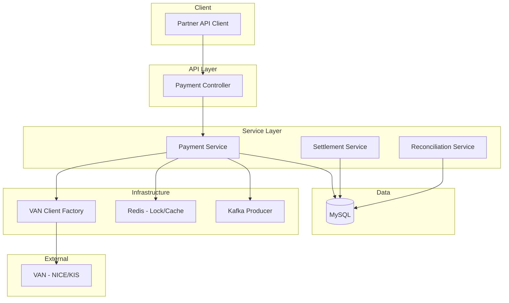

# Payment Gateway

> 파트너사를 위한 결제 승인/취소/매입 처리 API 게이트웨이 서비스

## 개요

대규모 트랜잭션을 안정적으로 처리하고, 데이터 정합성을 보장하는 결제 시스템입니다.
분산 환경에서의 동시성 제어, 멱등성 보장, VAN사 연동 추상화를 통해 안정적인 결제 서비스를 제공합니다.

### 핵심 기능

- **결제 승인/취소**: 카드 결제 승인 및 전체/부분 취소 지원
- **멱등성 보장**: Redis 기반 멱등성 키 관리로 중복 결제 방지
- **분산 락**: Redisson 기반 분산 락으로 동시성 이슈 해결
- **VAN사 연동**: 외부 결제 대행사 연동 추상화 계층
- **정산 배치**: 가맹점별 일자별 정산 데이터 집계
- **대사(Reconciliation)**: 내부/외부 데이터 정합성 검증

## 기술 스택

| 구분 | 기술 |
|------|------|
| **Backend** | Java 17, Spring Boot 3.2, Spring Data JPA |
| **Database** | MySQL 8.x, Redis |
| **Messaging** | Apache Kafka |
| **Query** | QueryDSL |
| **Batch** | Spring Batch |
| **Test** | JUnit 5, Mockito, Testcontainers |
| **Infra** | Docker, Docker Compose |
| **Docs** | Swagger (springdoc-openapi) |

## 아키텍처



### 주요 설계 결정

1. **분산 락을 통한 동시성 제어**
   - 동일 결제 건에 대한 동시 요청 방지
   - Redisson 기반 락으로 분산 환경 지원

2. **멱등성 보장**
   - 클라이언트 제공 멱등성 키로 중복 요청 필터링
   - Redis TTL을 활용한 키 자동 만료

3. **VAN사 연동 추상화**
   - Strategy 패턴으로 다양한 VAN사 지원
   - Factory 패턴으로 런타임 VAN 선택

4. **이벤트 기반 아키텍처**
   - Kafka를 통한 비동기 이벤트 발행
   - 결제/취소 이벤트의 느슨한 결합

## 실행 방법

### 사전 요구사항

- JDK 17+
- Docker & Docker Compose
- Gradle 8.x

### 로컬 환경 실행

```bash
# 인프라 컨테이너 실행
docker-compose up -d

# 애플리케이션 실행
./gradlew bootRun

# 테스트 실행
./gradlew test
```

### Docker Compose 실행

```bash
docker-compose up -d
```

## API 문서

애플리케이션 실행 후 Swagger UI에서 확인:
- http://localhost:8080/api/swagger-ui.html

### 주요 API

| Method | Endpoint | 설명 |
|--------|----------|------|
| POST | `/v1/payments/approve` | 결제 승인 |
| POST | `/v1/payments/cancel` | 결제 취소 |
| GET | `/v1/payments/{transactionId}` | 결제 상세 조회 |
| GET | `/v1/payments` | 결제 목록 조회 |

### 요청 예시

**결제 승인**
```bash
curl -X POST http://localhost:8080/api/v1/payments/approve \
  -H "Content-Type: application/json" \
  -H "X-Merchant-Id: M20231201001" \
  -d '{
    "orderId": "ORD-2024-001",
    "amount": 50000,
    "paymentMethod": "CARD",
    "cardNumber": "9410123456789012",
    "expiryDate": "1226",
    "installmentMonths": 0,
    "productName": "테스트 상품",
    "buyerName": "홍길동"
  }'
```

**결제 취소**
```bash
curl -X POST http://localhost:8080/api/v1/payments/cancel \
  -H "Content-Type: application/json" \
  -H "X-Merchant-Id: M20231201001" \
  -d '{
    "transactionId": "TXN20241215001234",
    "cancelAmount": 20000,
    "cancelReason": "고객 요청"
  }'
```

## 프로젝트 구조

```
src/main/java/com/paygate/payment/
├── common/                     # 공통 모듈
│   ├── exception/              # 예외 처리
│   ├── response/               # API 응답 포맷
│   └── util/                   # 유틸리티
├── config/                     # 설정
│   ├── JpaConfig.java
│   ├── RedisConfig.java
│   ├── KafkaConfig.java
│   └── BatchConfig.java
├── domain/                     # 도메인
│   ├── payment/                # 결제 도메인
│   │   ├── controller/
│   │   ├── service/
│   │   ├── repository/
│   │   ├── dto/
│   │   └── entity/
│   ├── merchant/               # 가맹점 도메인
│   └── settlement/             # 정산 도메인
└── infrastructure/             # 인프라
    ├── van/                    # VAN사 연동
    ├── kafka/                  # Kafka 연동
    └── redis/                  # Redis 연동
```

## 테스트

```bash
# 전체 테스트
./gradlew test

# 단위 테스트만
./gradlew test --tests "com.paygate.payment.unit.*"

# 통합 테스트만
./gradlew test --tests "com.paygate.payment.integration.*"
```

## 향후 개선 계획

- [ ] Spring WebFlux 기반 리액티브 마이그레이션
- [ ] 분산 트랜잭션 처리 (Saga 패턴)
- [ ] API Rate Limiting
- [ ] 결제 대시보드 UI

## 라이선스

This project is licensed under the MIT License.
