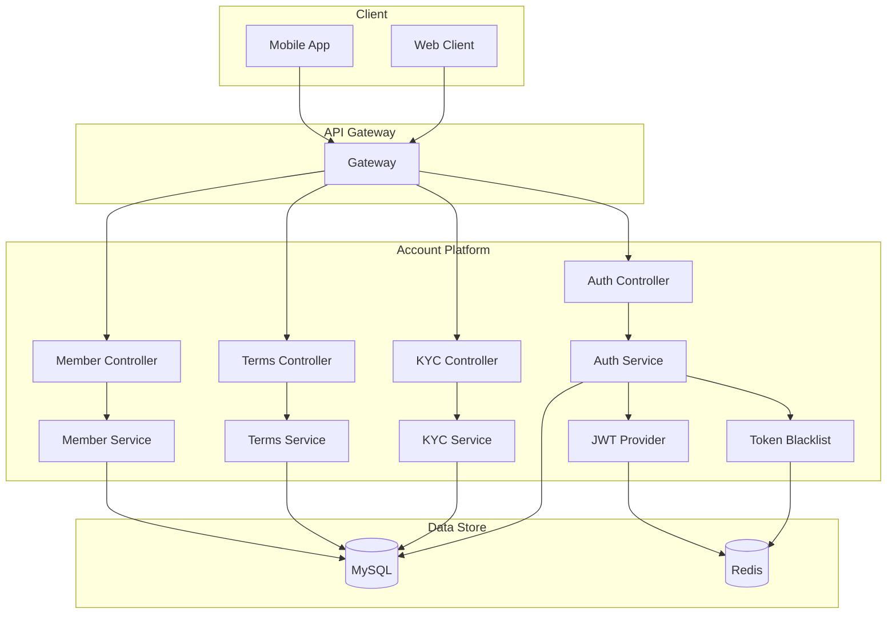

# Account Platform

대용량 트래픽 환경을 고려한 회원 계정 플랫폼입니다. 회원 가입/탈퇴, 약관 동의, JWT 기반 인증, KYC 인증 기능을 제공합니다.

## 핵심 기능

- **회원 관리**: 가입, 조회, 수정, 탈퇴, 정지/해제
- **인증/토큰**: JWT 기반 액세스토큰 발급, 리프레시 토큰 관리, 로그아웃 시 토큰 블랙리스트
- **약관 관리**: 약관 버전 관리, 필수/선택 약관 동의, 동의 이력 관리
- **KYC 인증**: 자금세탁방지를 위한 신원확인, 인증 레벨별 거래 한도 관리

## 기술 스택

### Backend
- Java 17
- Spring Boot 3.2
- Spring Data JPA + QueryDSL
- Spring Data Redis

### Database
- MySQL 8.0
- Redis (토큰 저장, 캐싱)

### Infrastructure
- Docker & Docker Compose
- Prometheus + Micrometer (모니터링)

## 아키텍처



## 프로젝트 구조

```
account-platform/
├── src/main/java/com/kakaopay/account/
│   ├── common/
│   │   ├── entity/          # BaseTimeEntity
│   │   ├── exception/       # 예외 처리, ErrorCode
│   │   ├── response/        # API 응답 포맷
│   │   └── util/            # 마스킹 등 유틸리티
│   ├── config/              # 설정 클래스
│   ├── domain/
│   │   ├── member/          # 회원 도메인
│   │   ├── auth/            # 인증/토큰 도메인
│   │   ├── terms/           # 약관 도메인
│   │   └── kyc/             # KYC 도메인
│   └── infrastructure/      # Redis 등 외부 연동
├── src/test/                # 테스트 코드
├── docs/                    # 기술 문서
└── docker/                  # Docker 설정
```

## 실행 방법

### 사전 요구사항
- JDK 17+
- Docker & Docker Compose

### 로컬 실행

```bash
# 인프라 실행 (MySQL, Redis)
docker-compose up -d

# 애플리케이션 실행
./gradlew bootRun

# 테스트 실행
./gradlew test
```

### Docker로 전체 실행

```bash
docker-compose --profile app up -d
```

## API 문서

애플리케이션 실행 후 Swagger UI에서 확인 가능합니다.

- Local: http://localhost:8080/swagger-ui.html

### 주요 API

| Method | Endpoint | 설명 |
|--------|----------|------|
| POST | `/api/v1/members` | 회원 가입 |
| GET | `/api/v1/members/{id}` | 회원 조회 |
| DELETE | `/api/v1/members/{id}` | 회원 탈퇴 |
| POST | `/api/v1/auth/login` | 로그인 |
| POST | `/api/v1/auth/refresh` | 토큰 갱신 |
| POST | `/api/v1/auth/logout` | 로그아웃 |
| GET | `/api/v1/terms` | 약관 목록 조회 |
| POST | `/api/v1/terms/members/{id}/agree` | 약관 동의 |
| POST | `/api/v1/kyc/members/{id}/verify` | KYC 인증 요청 |

## 주요 설계 결정

### 토큰 관리
- 액세스 토큰: 30분 유효, Stateless
- 리프레시 토큰: 7일 유효, Redis 저장으로 탈취 대응 가능
- 로그아웃 시 남은 유효시간 동안 블랙리스트 등록

### 동시성 제어
- 회원 상태 변경: JPA 낙관적 락 적용 가능
- 토큰 갱신: Redis 단일 키 갱신으로 원자성 보장

### 보안
- 개인정보 응답 시 마스킹 처리
- 내부 서비스 API 분리 (`/internal/api/...`)
- 로그인 시도 횟수 제한 (30분 내 5회)

## 모니터링

- Health Check: `GET /actuator/health`
- Prometheus Metrics: `GET /actuator/prometheus`

## 참고

- Spring MVC 기반으로 구현되었습니다. 대용량 트래픽 대응을 위해 Spring WebFlux 마이그레이션을 고려 중입니다.
- 현재는 단일 모듈 구조이나, 서비스 확장 시 멀티 모듈 구조로 전환 예정입니다.
