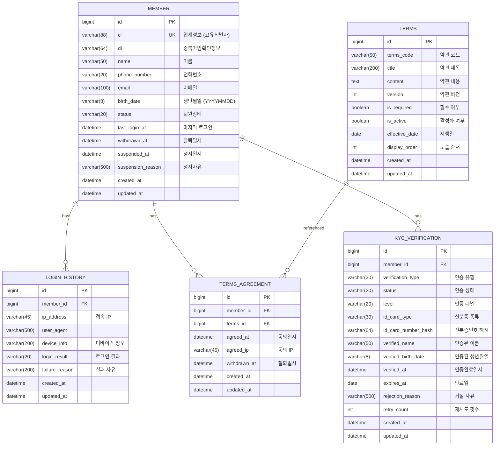

# ERD (Entity Relationship Diagram)

## 테이블 구조



## 인덱스 설계

### member
| 인덱스명 | 컬럼 | 용도 |
|---------|------|------|
| PRIMARY | id | PK |
| idx_member_ci | ci | CI 기반 회원 조회 (로그인) |
| idx_member_status | status | 상태별 회원 조회 |
| idx_member_phone | phone_number | 전화번호 기반 조회 |

### login_history
| 인덱스명 | 컬럼 | 용도 |
|---------|------|------|
| PRIMARY | id | PK |
| idx_login_history_member | member_id, created_at DESC | 회원별 로그인 이력 조회 |

### terms
| 인덱스명 | 컬럼 | 용도 |
|---------|------|------|
| PRIMARY | id | PK |
| idx_terms_code_version | terms_code, version (UNIQUE) | 약관 버전 조회 |
| idx_terms_active | is_active, effective_date | 활성 약관 목록 조회 |

### terms_agreement
| 인덱스명 | 컬럼 | 용도 |
|---------|------|------|
| PRIMARY | id | PK |
| idx_terms_agreement_member | member_id, terms_id | 회원별 동의 현황 조회 |
| idx_terms_agreement_terms | terms_id | 약관별 동의 통계 |

### kyc_verification
| 인덱스명 | 컬럼 | 용도 |
|---------|------|------|
| PRIMARY | id | PK |
| idx_kyc_member | member_id | 회원별 KYC 조회 |
| idx_kyc_status | status | 상태별 조회 (심사 대기 목록 등) |

## Redis 키 구조

### Refresh Token
```
Key: refresh_token:{uuid}
Value: {
  "id": "uuid",
  "memberId": 12345,
  "tokenValue": "jwt-token-value",
  "deviceInfo": "iPhone 15",
  "ipAddress": "192.168.1.1"
}
TTL: 7 days
```

### Token Blacklist
```
Key: token:blacklist:{jwt-token-value}
Value: "logout"
TTL: 토큰의 남은 유효시간
```

## 데이터 정합성

### 제약조건
- member.ci: UNIQUE (중복 가입 방지)
- terms.terms_code + terms.version: UNIQUE (동일 버전 중복 방지)
- kyc_verification.retry_count: 최대 3회로 애플리케이션 레벨 제한

### Soft Delete
- 회원 탈퇴: withdrawn_at 기록, 실제 데이터 삭제 안함 (법적 보관 의무)
- 약관 동의 철회: withdrawn_at 기록

## 파티셔닝 고려사항

대용량 데이터 시 고려할 파티셔닝 전략:

### login_history
- 시간 기반 파티셔닝 (월별)
- 3개월 이상 데이터는 아카이빙

### terms_agreement
- member_id 기반 해시 파티셔닝
- 또는 agreed_at 기준 시간 파티셔닝
